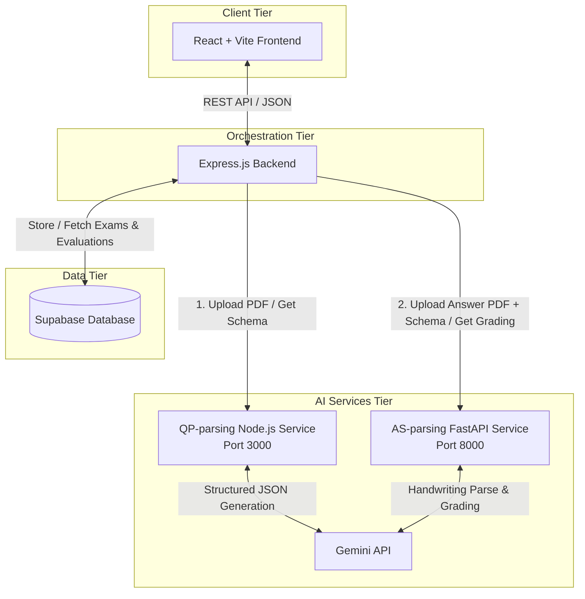

# Parakh: AI-Powered Unified Exam Paper Evaluation & Assessment Portal

**Parakh** is an automated, AI-driven answer sheet evaluation system designed to simplify, accelerate, and standardize the grading process. By leveraging advanced generative AI models (Gemini API), Parakh translates unstructured exam documents (PDFs, images) into structured schemas, extracts student handwritten responses, and evaluates them objectively based on custom rubrics.

This project was developed as part of the Summer Internship Program at the **AICTE IDEA Lab**, hosted under **USICT GGSIPU**, under the mentorship of **Dr. Raj Kumar**.

---

## 🏗️ System Architecture

The portal is organized as a microservices architecture consisting of a React frontend, an Express orchestration backend, a PostgreSQL/Supabase database, and twin AI services for question paper extraction and grading.



---

## 📂 Repository Structure

The project code is divided into four main directories:

```text
Parakh/
├── frontend/                  # React (Vite) Single Page Application
│   ├── src/
│   │   ├── components/        # Reusable UI components (PDF Uploader, etc.)
│   │   ├── pages/             # Landing, QP Upload, Answers Upload, Review Pages
│   │   ├── services/          # API services wrapper for backend communication
│   │   ├── App.jsx            # Routing and application entry point
│   │   └── index.css          # Styling system (Vanilla CSS)
│   ├── package.json
│   └── vite.config.js
│
├── backend/                   # Node.js Express Orchestrator
│   ├── config/                # Database connection configuration (Supabase)
│   ├── controllers/           # Request handlers for exams and evaluations
│   ├── middleware/            # Error handling and file type validation
│   ├── routes/                # API router definitions (/api/exams, /api/evaluations)
│   ├── services/              # Logic for database interaction and AI service routing
│   ├── app.js                 # Entry point running on Port 5000
│   └── package.json
│
├── ai-service/                # AI Microservices (Gemini API integrations)
│   ├── QP-parsing/            # Question Paper JSON schema parser (Node.js)
│   │   ├── controllers/       # Handles prompt building and Gemini file processing
│   │   ├── src/index.js       # Express server running on Port 3000
│   │   └── package.json
│   │
│   └── AS-parsing/            # Answer Sheet Grading & Evaluation (FastAPI)
│       ├── pydantic_models/   # Structured response schemas for validation
│       ├── app.py             # FastAPI server running on Port 8000
│       └── requirements.txt   # Python packages (fastapi, google-genai, etc.)
│
└── doc/                       # Project Documentation & Sample Files
    ├── Architectural docs/    # Schema JSON representations (e.g. jeeAdv2024QP.json)
    ├── test PDFs/             # Sample question papers and answer sheets
    ├── test images/           # Sample image assets
    ├── schema.sql             # Supabase database initialization DDL script
    └── Timeline.md            # Internship milestones and log
```

---

## ⚙️ System Requirements

Ensure the following tools are installed on your machine before setting up the project:
* **Node.js** (v18.x or later) & **npm**
* **Python** (v3.12.x or later) & **pip**
* **Git**
* A valid **Gemini API Key** (Get one from [Google AI Studio](https://aistudio.google.com/))
* A **Supabase account** (or a local PostgreSQL instance)

---

## 🚀 Step-by-Step Setup Guide

Follow these steps sequentially to set up and run the entire suite locally.

### Step 1: Database Setup (Supabase)
1. Go to your **Supabase Dashboard** and create a new project.
2. Navigate to the **SQL Editor** tab.
3. Copy the contents of `doc/schema.sql` and run the script. This will create two tables:
   * `exam_papers`: Stores parsed question paper schemas and rubrics.
   * `evaluations`: Stores student metadata, answer summaries, and grading results.
4. Disable Row Level Security (RLS) as configured in `schema.sql` for initial development, or define custom security policies.
5. In your Supabase settings, retrieve the following variables:
   * **Project URL**
   * **API Key** (anon public)

---

### Step 2: Set Up & Run the AI Services

You must run **both** AI services concurrently since they handle different evaluation tasks.

#### A. Question Paper Parsing Service (`QP-parsing`)
This service parses question papers (PDFs/Images) into structured JSON schemas using Gemini.
1. Navigate to the sub-service directory:
   ```bash
   cd ai-service/QP-parsing
   ```
2. Copy the environment template:
   ```bash
   # Windows (PowerShell)
   Copy-Item .env.example .env
   # Linux / macOS
   cp .env.example .env
   ```
3. Open `.env` and fill in your details:
   ```env
   GEMINI_API_KEY=your_gemini_api_key_here
   PORT=3000
   ```
4. Install dependencies and start the service:
   ```bash
   npm install
   npm start
   ```
   *The service will listen on: `http://localhost:3000`*

#### B. Answer Sheet Parsing Service (`AS-parsing`)
This service evaluates student handwritten answer sheets against the parsed question/rubric JSON.
1. Navigate to the sub-service directory:
   ```bash
   cd ai-service/AS-parsing
   ```
2. Copy the environment template:
   ```bash
   # Windows (PowerShell)
   Copy-Item .env.example .env
   # Linux / macOS
   cp .env.example .env
   ```
3. Open `.env` and add your key:
   ```env
   GEMINI_API_KEY=your_gemini_api_key_here
   ```
4. Create and activate a Python virtual environment:
   ```bash
   # Windows (PowerShell)
   python -m venv .venv
   .venv\Scripts\Activate.ps1

   # Linux / macOS
   python -m venv .venv
   source .venv/bin/activate
   ```
5. Install dependencies:
   ```bash
   pip install -r requirements.txt
   ```
6. Start the FastAPI development server:
   ```bash
   fastapi dev app.py
   # OR
   uvicorn app:app --reload
   ```
   *The service will run on: `http://localhost:8000` (docs available at `http://localhost:8000/docs`)*

---

### Step 3: Set Up & Run the Express Backend
The backend acts as the orchestrator connecting the DB, AI services, and client.
1. Navigate to the backend directory:
   ```bash
   cd backend
   ```
2. Copy the environment template:
   ```bash
   # Windows (PowerShell)
   Copy-Item .env.example .env
   # Linux / macOS
   cp .env.example .env
   ```
3. Open `.env` and specify port and Supabase credentials:
   ```env
   PORT=5000
   SUPABASE_URL=your_supabase_project_url
   SUPABASE_ANON_KEY=your_supabase_anon_key
   AI_SERVICE_URL=http://localhost:3000
   AI_EVALUATION_SERVICE_URL=http://localhost:8000
   ```
4. Install dependencies and run in development mode:
   ```bash
   npm install
   npm run dev
   ```
   *The server will run on: `http://localhost:5000`*

---

### Step 4: Set Up & Run the Frontend Application
The user interface connects directly to the backend.
1. Navigate to the frontend directory:
   ```bash
   cd frontend
   ```
2. Copy the environment template:
   ```bash
   # Windows (PowerShell)
   Copy-Item .env.example .env
   # Linux / macOS
   cp .env.example .env
   ```
3. Open `.env` and configure the backend URL:
   ```env
   VITE_BACKEND_URL=http://localhost:5000
   ```
4. Install dependencies and start the Vite server:
   ```bash
   npm install
   npm run dev
   ```
   *The client application will run on: `http://localhost:5173`*

---

## 📡 API Endpoint Reference

### 🔌 Backend Orchestrator (`PORT 5000`)

#### 1. Upload Question Paper
* **Endpoint**: `POST /api/exams/upload-paper`
* **Content-Type**: `multipart/form-data`
* **Payload**: `files` (PDF / Image)
* **Response**: Returns a detailed structured JSON representation of the questions and default rubrics parsed from the document.

#### 2. Save Rubric
* **Endpoint**: `POST /api/exams/generate-rubric`
* **Content-Type**: `application/json`
* **Payload**:
  ```json
  {
    "pdf_filename": "exam_2026.pdf",
    "parsed_data": { ... }
  }
  ```
* **Response**: Saves the final question rubric schema to Supabase and returns the database project record ID.

#### 3. Upload & Grade Answers
* **Endpoint**: `POST /api/evaluations/upload-answers`
* **Content-Type**: `multipart/form-data`
* **Payload**:
  * `files` (Student Answer Sheet PDF)
  * `question_paper_id` (UUID generated in Step 2)
  * `student_name` (Optional string)
* **Response**: Returns the complete AI-generated grading evaluation details, including marks awarded, rubric items satisfied, and errors. It stores the evaluation in the database.

---

## 🧪 Testing the Pipeline
To verify your installation without uploading your own custom documents:
1. Navigate to `doc/test PDFs/` which contains pre-configured question papers and handwritten student response samples.
2. Import the sample templates to see how the system performs.
3. You can also test endpoints directly using tools like **Postman** by targeting the backend port `5000` or individual AI service docs (`http://127.0.0.1:8000/docs`).

---

## 👥 Contributors (Team Parakh)
* **Aaditya Pokhriyal** - Team Leader / Backend Developer & AI Lead
* **Divyanshu** - Backend Developer & AI Architect (Concept Originator)
* **Gaurav Verma** - Frontend Developer
* **Anshu** - Frontend Developer
* **Jai Singh Rathore** - UI/UX Designer
* **Raj** - UI/UX Designer