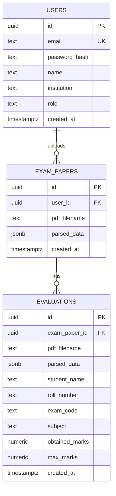

# 🗄️ Database Design

This document details the database schema and layout configured inside **Supabase (PostgreSQL)** for the exam evaluation system.

---

## 🧬 Entity Relationship Diagram

The PostgreSQL database maintains a relationship where teachers/users own their uploaded exam paper templates, and each template has multiple student evaluations.



---

## 🗂️ Table Specifications

### 1. Table: `users`
This table stores details of registered teachers and admins for system access and token generation.

| Field Name | PostgreSQL Type | Constraints | Description |
| :--- | :--- | :--- | :--- |
| `id` | `UUID` | `PRIMARY KEY`, `DEFAULT gen_random_uuid()` | Unique identifier for the user. |
| `email` | `TEXT` | `UNIQUE`, `NOT NULL` | The unique login email address of the teacher/user. |
| `password_hash` | `TEXT` | `NOT NULL` | The salted bcrypt hash of the user's password. |
| `name` | `TEXT` | `NOT NULL` | The full name of the teacher/user. |
| `institution` | `TEXT` | `NOT NULL` | The school/institution affiliation of the user. |
| `role` | `TEXT` | `NOT NULL`, `DEFAULT 'Teacher'` | User authorization role (e.g., `'Teacher'`). |
| `created_at` | `TIMESTAMPTZ` | `DEFAULT now()` | Timestamp when the user registered. |

---

### 2. Table: `exam_papers`
This table stores the question paper structures, questions, marks distribution, and grading rubrics generated during ingestion, linked to the uploading teacher.

| Field Name | PostgreSQL Type | Constraints | Description |
| :--- | :--- | :--- | :--- |
| `id` | `UUID` | `PRIMARY KEY`, `DEFAULT gen_random_uuid()` | Unique identifier for the exam paper. |
| `user_id` | `UUID` | `FOREIGN KEY` references `users(id)` `ON DELETE CASCADE` | Link to the teacher who uploaded the paper. |
| `pdf_filename` | `TEXT` | `NOT NULL` | The original filename of the uploaded question paper PDF. |
| `parsed_data` | `JSONB` | `NOT NULL` | The complete structured JSON containing exam metadata, sections, questions list, marks, and rubrics (matches [question_paper_schema.md](./question_paper_schema.md)). |
| `created_at` | `TIMESTAMPTZ` | `DEFAULT now()` | Timestamp when the question paper was saved/compiled. |

---

### 3. Table: `evaluations`
This table stores the results of individual student answer sheet evaluations.

| Field Name | PostgreSQL Type | Constraints | Description |
| :--- | :--- | :--- | :--- |
| `id` | `UUID` | `PRIMARY KEY`, `DEFAULT gen_random_uuid()` | Unique identifier for this evaluation record. |
| `exam_paper_id` | `UUID` | `FOREIGN KEY` references `exam_papers(id)` `ON DELETE CASCADE` | Associated question paper. If the exam paper is deleted, all its evaluations are removed automatically. |
| `pdf_filename` | `TEXT` | `NOT NULL` | Filename of the student's handwritten answer sheet. |
| `parsed_data` | `JSONB` | `NOT NULL` | The complete evaluated JSON detailing student metadata, marked answer blocks, matched criteria, marks, and diagrams (matches [answer_sheet_schema.md](./answer_sheet_schema.md)). |
| `student_name` | `TEXT` | - | The student's name extracted by AI (or manually corrected). |
| `roll_number` | `TEXT` | - | The student's roll number extracted by AI. |
| `exam_code` | `TEXT` | - | The subject/exam code extracted by AI. |
| `subject` | `TEXT` | - | The subject name extracted by AI. |
| `obtained_marks`| `NUMERIC` | - | Sum of all marks awarded to the student (dynamically calculated on saving). |
| `max_marks` | `NUMERIC` | - | The total potential marks of the exam paper template (for statistics). |
| `created_at` | `TIMESTAMPTZ` | `DEFAULT now()` | Timestamp when the answer sheet evaluation was completed. |

---

## ⚙️ Optimization & Gin Indexing

Since key metadata (such as roll numbers, subject, and student names) is extracted into the `parsed_data` JSONB columns, querying nested JSON structures using the standard `@>` (contains) operator is highly performant in PostgreSQL when using **GIN (Generalized Inverted Index)**.

If query volume grows, add the following indexes to your Supabase PostgreSQL instance:

```sql
-- Create a GIN index on the parsed_data JSONB column of evaluations for fast searching
CREATE INDEX idx_evaluations_parsed_data_gin ON public.evaluations USING gin (parsed_data);

-- Create a GIN index on the parsed_data JSONB column of exam_papers
CREATE INDEX idx_exam_papers_parsed_data_gin ON public.exam_papers USING gin (parsed_data);
```

---

## 🔒 Security Configuration (Row Level Security)

By default, RLS is enabled in [schema.sql](./schema.sql) to protect user and exam details from unauthorized access:
```sql
ALTER TABLE public.users ENABLE ROW LEVEL SECURITY;
ALTER TABLE public.exam_papers ENABLE ROW LEVEL SECURITY;
ALTER TABLE public.evaluations ENABLE ROW LEVEL SECURITY;
```

### Access Policies

Below are typical staging and production policies applied on top of these tables to guarantee data isolation between teachers:

1. **`users` Table Policies:**
   *   Only authenticated users can read/modify their own profiles.
   
2. **`exam_papers` Table Policies:**
   *   **Insert:** Any authenticated user with a `Teacher` role can insert.
   *   **Select/Update/Delete:** An authenticated user can only view or modify records where `user_id = auth.uid()`.

3. **`evaluations` Table Policies:**
   *   **Select/Insert/Delete:** An authenticated user can only view, create, or delete evaluations linked to `exam_papers` they own (`exam_papers.user_id = auth.uid()`).
